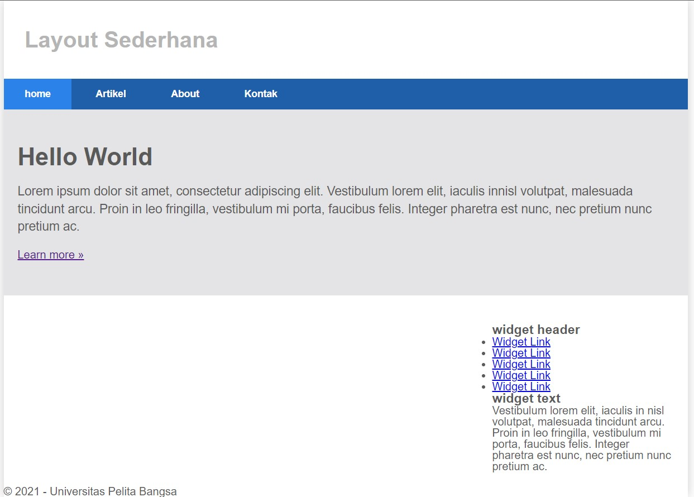

# Tugas pertemuan ke 3
Repository ini digunakan untuk memenuhi Tugas Lab2Web

Nama    : Dani Darmawan 
NIM     : 312010154 
KELAS   : TI.20.B1  
## Tampilan Awal
 
 

## Membuat Navigasi
 
 

## Membuat Hero Panel
 
 

## Mengatur Layout Main dan Sidebar
 
 
 

## Membuat Sidebar Widget
 
 
 
 
 
 

## Mengatur Footer
 
 

## Menambahkan Elemen lainnya pada Main Content
 
 
 
 
 
 

## Menambahkan Content Artikel
 
 
 
 

